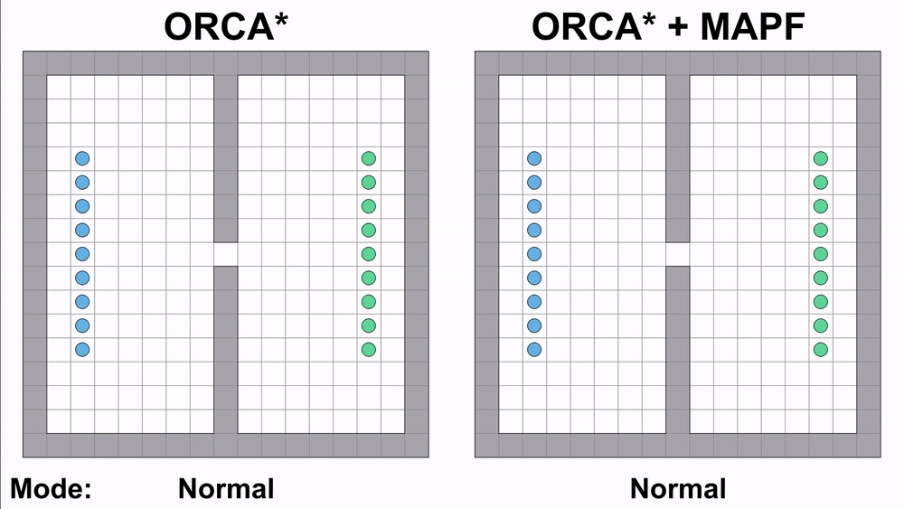
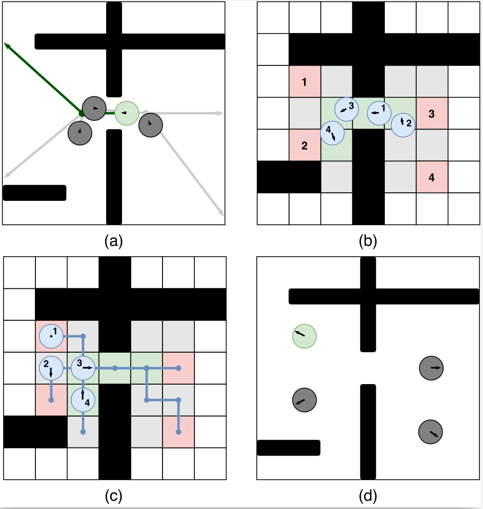

# Distributed Multi-agent Navigation Based on ORCA Algorithm



Implementation of distributed multi-agent navigation algorithm based on combination of reciprocal 
collision avoidance and individual path planner. There is an option that activate deadlock avoidance by locally 
confined multi-agent path finding (MAPF) solvers, that coordinate sub-groups of the agents that appear to be in a deadlock.

This is supplementary code for papers:

1. S. Dergachev and K. Yakovlev, "Distributed Multi-Agent Navigation Based on Reciprocal Collision Avoidance and Locally Confined Multi-Agent Path Finding," in Proceedings of the 17th International Conference on Automation Science and Engineering (CASE 2021), Lyon, France, 2021, pp. 1489-1494 [[PDF](https://arxiv.org/pdf/2107.00246.pdf)]
2. S. Dergachev, K. Yakovlev, and R. Prakapovich, “A Combination of Theta*, ORCA and Push and Rotate for Multi-agent Navigation,” in Proceedings of the 5th International Conference on Interactive Collaborative Robotics (ICR 2020), 2020, pp. 55–66. [[PDF](https://arxiv.org/pdf/2008.01227.pdf)]

## Description

### Decentrilized Navigation
The algorithm is based on the idea of planning a global path for all agents independently 
and moving along this path with local collision avoidance. 
Theta* algorithm are using to global path planning and ORCA algorithm are using for 
local collision avoidance with agents and static obstacles. 
Also direct moving to goal without global planning is available.

**Theta*** is a version of A* algorithm for any-angle path planning on grids. 
Theta* mostly the same as A*, but, unlike A*, 
Theta* allows parent of current vertex may be any other vertex, 
which are visible from current [[1](https://arxiv.org/pdf/1401.3843.pdf)].

The **ORCA** algorithm is a decentralized collision avoidance algorithm in a 
multi-agent environment. The main idea of the algorithm is iterative selection 
of new agent speed, close to a certain preferred velocity. Selection of 
the new speed is based on ORCA principle. 
**Optimal Reciprocal Collision Avoidance (ORCA)** — the principle, 
which provides a sufficient condition for multiple robots to avoid 
collisions among one another, and thus can guarantee collision-free 
navigation [[2](http://gamma.cs.unc.edu/ORCA/publications/ORCA.pdf)]. 
The principle is based on the concept of velocity obstacles, which are 
used to search for a new  speed of agent so that during the time **_t_** there 
is no collision with other agents. In the process of searching for a new velocity, 
algorithm creates a set of n-1 linear constraints(where n is the number of agents 
that the current one takes into account). A new velocity (Vnew) that satisfies these 
constraints and is close to the preferred velocity, are searched using an linear programming. 
The preferred velocity is selected so that the agent makes a move to the target point. 
More information about ORCA algorithm you can find at 
ORCA creators web page [[3](http://gamma.cs.unc.edu/ORCA/)].


The agent is a disk of radius _r_ centered at _p_ with their start and 
global goal positions. For each neighboring agent (located at a distance _R_ or less), 
their position and current speed are known. At the beginning of task execution every 
agent tries to find a path to their global goal, using Theta* algorithm. 
After getting of global path (which is a sequence of points in space, where the 
first point is the global goal), agent begin moving. First target point is the 
last element in path sequence. At each simulation step, for each agent, a new 
velocity _Vnew_ are searched, using ORCA algorithm. 
After that global simulation time is changed to _dt_, the position of all agents 
is changed to _dt_ * _Vnew_ (own for each agent) and every agent compute new target point. 
If the agent has reached the last point in the sequence, then the next point in the 
sequence becomes the target, and the previous one is deleted. Otherwise, a 
visibility check is made between the agent’s position and the last point. If 
visibility is confirmed, then the last becomes the target point, otherwise the path 
from the agent's position to the last point is searched. 
High-level  pseudocode  of  the  suggested  method  is  presented below


### Deadlock Avoidance
In numerous scenarios, involving navigation through the tight passages or  confined spaces, deadlocks are likely to occur due to the egoistic behaviour  of the agents and as a result, the latter can not achieve their goal. To reach the goals the agents may to exhibit a form of coordination and some of them could to yield to the others.



So, it each time step, an agent gathers the information about the states of the agents that are within the 
communication/visibility  range (neighbours). This data is used not only to choose the velocity but also to detect deadlocks. If a deadlock is detected (Picture (a) on figure above) an agent initiates switching to the MAPF mode.  As a result, certain  agents  enter  this  mode.  These  agents share  the  information  about  their  states  and  current  goals (waypoints  on  the  geometric  paths  that  they  want  to  reach) so  each  of  them  possess  the  same  local  world  model.  The latter is used to create a MAPF (Multi-Agent Pathfinding) instance and solve it (Picture (b) on figure above).  We  emphasize  that  each  agent  operates  individually in  the MAPF  mode and  no central controller  is  introduced. However  as  the  operations  in  this  mode  are deterministic and  each  agent  knows  the  states  and  goals  of  other agents, the result of forming a MAPF instance and solving it is the same  across  all  involved  agents.  In our works we suggest using Push and Rotate [[4](https://www.ifaamas.org/Proceedings/aamas2013/docs/p87.pdf)] and ECBS [[5](https://ojs.aaai.org/index.php/SOCS/article/download/18315/18106)] algorithms. Consequently,  each agent obtains  the  same  MAPF  solution  –  a  set  of  collision-free plans (Picture (c) on figure above). It then  extracts  its  individual  plan  from  this  solution and follows it to resolve the deadlock. After all agents finish execution  of  their  MAPF  plans  they  switch  back  to  normal mode, i.e.  continue  moving  to  the  next  waypoint  on  their geometric path utilizing collision avoidance (Picture (d) on figure above). High-level  pseudocode  of  the  suggested  method  is  presented below


## Running the Implementation
Code is written in C++ and is meant to be cross-platform. 
Implementation relies only on C++14 standard and STL. 

Open-source library to work with XML (tinyXML2) is included as git submodule
(in `external` subdirectory).

Original implementation of MAPF algorithms you can find in GitHub repository [[6](https://github.com/PathPlanning/Push-and-Rotate--CBS--PrioritizedPlanning)]

To build and run the project you can use CMake, `CMakeLists.txt` file is available in the repo. 
Please note that the code relies on C++14 standard. Make sure that your compiler supports it. At the moment, the build and launch were tested only on Manjaro Linux using the GCC 13.1 C++ compiler.

### Download

Download current repository to your local machine. Use:
```bash
git clone --recurse-submodules git@github.com:PathPlanning/ORCA-algorithm.git
```

There are several options to build this project. Use the following commands to build:

#### Build

**_Linux_**
```bash
cd ORCA-algorithm
mkdir build
cd build
cmake -DCMAKE_BUILD_TYPE={Release/Debug} -DFULL_OUTPUT_FLAG={ON/OFF} -DFULL_LOG_FLAG={ON/OFF} -DMAPF_LOG_FLAG={ON/OFF} ..
make
```

where optins:
- `CMAKE_BUILD_TYPE` — Standart CMake option that specifies the build type. For more information see [[CMake Documantation](https://cmake.org/cmake/help/latest/variable/CMAKE_BUILD_TYPE.html)]    
etc
  - `Release` uses to build with no debugging information. 
  - `Debug` usually uses to enable debugging information, disable optimization 
- `FULL_OUTPUT_FLAG` — Enables/disables full output to stdout about reading xml files.
- `FULL_LOG_FLAG` — Enables/disables logging to xml file agents state information
- `MAPF_LOG_FLAG` — Enables/disables logging to xml files information about MAPF instances in coordinated mode

## Launch
There are two options to test the algorithm: single test on one task and series of tasks.
Use the following command to launch single test:

```bash
./single_test {file_name num}
```
where 
- `file_name` — name of the XML file, which contain task;
- `num` — the number of agents with which tasks will run.

For example:
```bash
./single_test ../task_examples/empty_task.xml 10
```
  
Summary will be displayed after execution using standard output, full log (if such option in in CMake was chosen) will be saved in same directory as task file and will be named according to the following pattern:
```
*taskfilename*_*number_of_agents*_log.xml
```
For example:
```
empty_task_10_log.xml
```


Use the following command to launch series test:
```bash
./series_test {n_min n_step n_max n_tasks path}
```
where 
- `n_min` — the initial number of agents at which tasks will run;
- `n_step` — step of changing the number of agents when restarting tasks;
- `n_max` — the final number of agents at which tasks will run;
- `n_tasks` — the number of tasks in series;
- `path` — path to the folder, which contains task files; 

For example:
```bash
./series_test 5 5 10 2 ../task_examples
```

To run the series tests and get a result you need to pass a correct input XML-file(s). The task files must be named according to the following pattern:
```
*number*_task.xml
```
Moreover, the numbering of tasks should form a sequence of numbers from **_0_** to **_n_tasks-1_**.
For example:
```
0_task.xml
1_task.xml
```

If the number of agents in the task is less than the required value, it will be started with the number of agents specified in the task.

Summary will be written after execution of each task in file `path/result.txt`, full log (if such option was chosen) will be saved at _path_ and will be named according to the following pattern:
```
*taskfilename*_*numberofagents*_log.xml
```
For example:
```
0_task_15_log.xml
```


## Input and Output files and Other Options
### Input files
Input files are an XML files with a specific structure.  
Input file should contain:

* Mandatory tag `<agents>`. It describes the parameters of the agents.
    * `number` — mandatory attribute that define the number of agents;
    * `type` — attribute that define the type of agents. Possible values: 
      - `orca` — running the algorithm in standart mode without avoiding deadlocks
      - `orca-par` — running the algorithm with avoiding deadlocks using Push and Rotate algorithm to create common coordinated plan. For more detains see out paper "A Combination of Theta*, ORCA and Push and Rotate for Multi-agent Navigation".
      - `orca-par-ecbs` — running the algorithm with avoiding deadlocks using combination of Push and Rotate and ECBS algorithms to create common coordinated plan. For more detains see out paper "Distributed Multi-Agent Navigation Based on Reciprocal Collision Avoidance and Locally Confined Multi-Agent Path Finding".
      - `orca-return` — experimental mode in which random agents return to their previous waypoints in case of deadlocks.
    * `<default_parameters>` — mandatory tags that defines default parameters of agents and agent's perception.
      * `agentsmaxnum` — mandatory attribute that defines a number of neighbors, that the agent takes into account;
      * `movespeed` — mandatory attribute that defines maximum speed of agent;
      * `sightradius` — mandatory attribute that defines the radius in which the agent takes neighbors into account;
      * `size` — mandatory attribute that defines size of the agent (radius of the agent);
      * `timeboundary` — mandatory attribute that defines the time within which the algorithm ensures collision avoidance with other agents;
      * `timeboundaryobst` — mandatory attribute that defines the time within which the algorithm ensures collision avoidance with static obstacles.
    * `<agent>` — mandatory tags that defines parameters of each agent.
        * `id` — mandatory attribute that defines the identifier of agent;
        * `start.xr` — mandatory attribute that defines the coordinate of start position on the x-axis (hereinafter, excluding `map` tag, points (x,y) are in coordinate system, which has an origin (0,0) in lower left corner. More about coordinate systems in the illustration below);
        * `start.yr` — mandatory attribute that defines the coordinate of start position on the y-axis; 
        * `goal.xr` — mandatory attribute that defines the coordinate of finish position on the x-axis; 
        * `goal.yr` — mandatory attribute that defines the coordinate of finish position on the y-axis; 
        * `agentsmaxnum` — attribute that defines a number of neighbors, that the agent takes into account;
        * `movespeed` — attribute that defines maximum speed of agent;
        * `sightradius` — attribute that defines the radius in which the agent takes neighbors into account;
        * `size` — attribute that defines size of the agent (radius of the agent);
        * `timeboundary` — attribute that defines the time within which the algorithm ensures collision avoidance with other agents;
        * `timeboundaryobst` — attribute that define the time within which the algorithm ensures collision avoidance with static obstacles.
* Mandatory tag `<map>`. It describes the environment for global path planning.
  * `<height>` and `<width>` — mandatory tags that define size of the map. Origin is in the upper left corner. (0,0) - is upper left, (*width*-1, *height*-1) is lower right (more about coordinate systems in the illustration below). 
  * `<cellsize>` — optional tag that defines the size of one cell.
  * `<grid>` — mandatory tag that describes the square grid constituting the map. It consists of `<row>` tags. Each `<row>` contains a sequence of "0" and "1" separated by blanks. "0" stands for traversable cell, "1" — for untraversable (actually any other figure but "0" can be used instead of "1").

* Mandatory tag `<obstacles>`. It describes static obstacles for collision avoidance.
  * `number` — mandatory attribute that defines the number of obstacles;
  * `<obstacle>` — mandatory tags which defines each static obstacles for collision avoidance.
    * `<vertex>` — mandatory tags which defines vertex of static obstacle for collision avoidance. 
      *  `xr` — mandatory attribute that defines the coordinate of vertex on the x-axis; 
      *  `yr` — mandatory attribute that defines the coordinate of vertex on the y-axis.
  
* Mandatory tag `<algorithm>`. It describes the parameters of the algorithm.
  * `<delta>` — mandatory tag that defines the distance between the center of the agent and the finish, which is enough to reach the finish (ORCA parameter);
  * `<timestep>` — mandatory tag that defines the time step of simulation (ORCA parameter);
  * `<searchtype>` — tag that defines the type of planning. Possible values - "thetastar" (use Theta* for planning), "direct" (turn off global planning and always use direction to global goal). Default value is "thetastar" (global planning parameter);
  * `<breakingties>` — tag that defines the priority in OPEN list for nodes with equal f-values. Possible values - "0" (break ties in favor of the node with smaller g-value), "1" (break ties in favor of the node with greater g-value). Default value is "0" (Theta* parameter);
  * `<cutcorners>` — boolean tag that defines the possibilty to make diagonal moves when one adjacent cell is untraversable. The tag is ignored if diagonal moves are not allowed. Default value is "false" (Theta* parameter);
  * `<allowsqueeze>` — boolean tag that defines the possibility to make diagonal moves when both adjacent cells are untraversable. The tag is ignored if cutting corners is not allowed. Default value is "false" (Theta* parameter);
  * `<hweight>` — defines the weight of the heuristic function. Should be real number greater or equal 1. Default value is "1" (Theta* parameter);
  * `<trigger>` — defines the switching to the coordinated mode trigger. Possible values:
    - `speed-buffer` — use average speed for deadlock detection. For more detains see out paper "Distributed Multi-Agent Navigation Based on Reciprocal Collision Avoidance and Locally Confined Multi-Agent Path Finding".
    - `common-point` — use information about movement to a common waypoint for deadlock detection. For more detains see out paper "A Combination of Theta*, ORCA and Push and Rotate for Multi-agent Navigation".
  * `<mapfnum>` — defines the minimum number of agents that should move towards a common waypoint (for `common-point` trigger)


Examples locates in directory `task_examples`.

### Other Options

The implementation also contains a number of options that affect the operation of algorithms and experiments, but are not included in the input files (Sorry for that).

In `include/const.h` file:
- `COMMON_SPEED_BUFF_SIZE` — the number of steps that are taken into account to calculate the average speed that is used as a criterion for stopping the execution of an instance.
- `MISSION_SMALL_SPEED` — the value, when the average speed decreases below which the execution of the instance stops.
- `SPEED_BUFF_SIZE` — the number of steps that are taken into account to calculate the average speed that is used as a criterion for deadlock detection (for `speed-buffer` trigger).
- `SMALL_SPEED` — the value, when the average speed decreases below which the agent assume that deadlock is occured (for `speed-buffer` trigger).
- `ECBS_SUBOUT_FACTOR` — Sub-optimal factor for ECBS algorithm.

In `src/experiments/single_test.cpp` or `src/experiments/series_test.cpp`:
- `STEP_MAX` — the maximum number of simulation steps.
- `STOP_BY_SPEED` — enables/disables instance execution halting depending on the average speed of the agents.
- `IS_TIME_BOUNDED` — enables/disables instance execution halting depending on the runtime.
- `TIME_MAX` — the maximum runtime in ms.

### Output files
#### Summary 

Contains the main information about the execution of tasks in series test. 
There are 6 columns:

* `success_rate` — shows the percent of agents, which succeed their tasks; 
* `run_time` — shows the time of running of task;
* `flow_time` — shows the sum of steps of all agents;
* `makespan` — shows the maximum value of steps of amoung all agents;
* `collisions` — shows the number of collisions between agents while execution of task;
* `collisions_obs` — shows the number of collisions between agents and static obstacles while execution of task;
* `init_count` — shows the number of coordinated mode launches;
* `unite_count` — shows the number of mergers of two coordinated groups;
* `update_count` — shows the number of updates of the coordinated plan when one or more uncoordinated agents are added;
* `ecbs_count` — shows the number of ECBS algorithm launches (only for `orca-par-ecbs` type);
* `par_count` — shows the number of Push and Rotate algorithm launches (only for `orca-par-ecbs` type);
* `success_count` — shows the number of successful coordinated mode launches;
* `unsuccess_count` — shows the number of unsuccessful coordinated mode launches;
* `mapf_flowtime` — shows the sum of steps of all agents in coordinated mode;
* `mapf_runtime` — shows computational time of MAPF algorithms;

#### Full log

Contains the full information about the execution of each task. 
Includes same tags as input file, summary and information about steps of each agent.


Summary example:
```xml
<summary successrate="100" runtime="1.061" makespan="170.90001" flowtime="477.60001" collisions="0" collisionsobst="0"/>
```
Agent's path example:
```xml
<agent number="0">
    <path pathfound="true" steps="4">
        <step number="0" x="33.18066" y="9.1728058"/>
        <step number="1" x="33.36132" y="9.3456116"/>
        <step number="2" x="33.541981" y="9.5184174"/>
        <step number="3" x="33.722641" y="9.6912231"/>
    </path>
</agent>
```
Examples locates in directory `task_examples`.

## Links

1. [Daniel K. et al. Theta*: Any-angle path planning on grids // Journal of Artificial Intelligence Research. 2010. V. 39. P. 533-579.](https://arxiv.org/pdf/1401.3843.pdf)
2. [Van Den Berg J. et al. Reciprocal n-body collision avoidance // Robotics research. 2011. P. 3-19.](http://gamma.cs.unc.edu/ORCA/publications/ORCA.pdf)
3. [ORCA creators webpage](http://gamma.cs.unc.edu/ORCA/)
4. [De Wilde B., Ter Mors A. W., Witteveen C. Push and Rotate: cooperative multi-agent path planning // Proceedings of the 2013 international conference on Autonomous agents and multi-agent systems. 2013. P. 87-94.](https://www.ifaamas.org/Proceedings/aamas2013/docs/p87.pdf)
5. [Barer M. et al. Suboptimal variants of the conflict-based search algorithm for the multi-agent pathfinding problem // Proceedings of the International Symposium on Combinatorial Search. 2014. V. 5. N. 1. P. 19-27.](https://ojs.aaai.org/index.php/SOCS/article/download/18315/18106)
6. [ECBS and PUSH AND ROTATE implementation](https://github.com/PathPlanning/Push-and-Rotate--CBS--PrioritizedPlanning)
